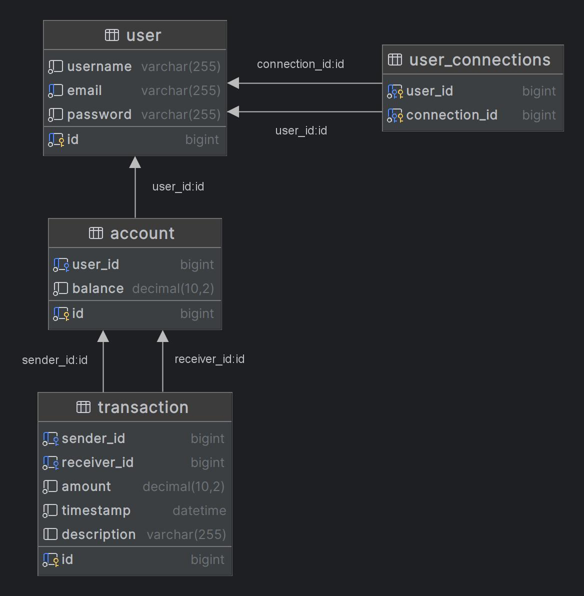

# Projet 6 - OpenClassrooms
## Script Setup SQL
src/main/resources/database_setup.sql

## Modèle Physique de Données (MPD)

Voici le schéma de la base de données :

- **Table User** : Contient les informations des utilisateurs.
- **Table Account** : Stocke les soldes des comptes liés aux utilisateurs.
- **Table Transaction** : Enregistre les transferts d’argent entre utilisateurs.
- **Table User_Connections** : Gère les relations entre utilisateurs (amis ou connexions).

Légende des icônes du schéma :

| Icon                                                                                 | Foreign key | Primary key | Indexed | NOT NULL |
|--------------------------------------------------------------------------------------|:-----------:|:-----------:|:-------:|:--------:|
|                     |             |             |         |          |
|                  |             |             |         |    X     |
|             |             |             |    X    |    X     |
|      |      X      |             |    X    |    X     |
|      |             |      X      |    X    |    X     |
|  |      X      |      X      |    X    |    X     |

